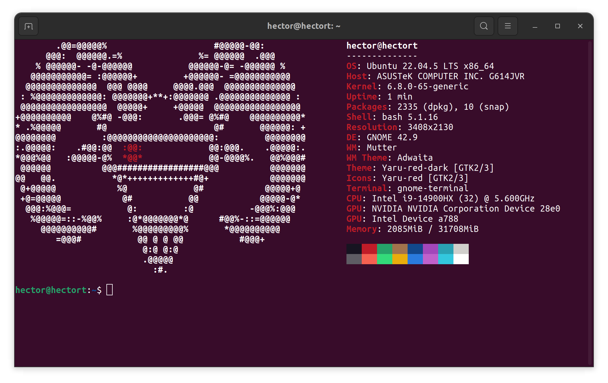

# 🖥️ Terminal Setup with Neofetch and Custom Size

This guide documents how to install and configure [Neofetch](https://github.com/dylanaraps/neofetch) to launch automatically when opening the terminal, as well as how to customize the default terminal window size for both **GNOME Terminal** and **Terminator**.

---

## 📦 Installation

1. **Clone the Neofetch repository and navigate into it:**

   ```bash
   git clone https://github.com/RoBorregos/neofetch.git
   cd neofetch
   ```

2. **Install it globally:**

   ```bash
   sudo make install
   ```

---

## 🚀 Auto-run Neofetch on Terminal Launch

### If using Bash:
1. Add `neofetch` at the end of your `~/.bashrc`:

   ```bash
   nano ~/.bashrc
   ```

2. Add this line at the bottom:

   ```bash
   neofetch
   ```

3. Then apply the changes:

   ```bash
   source ~/.bashrc
   ```

### If using Zsh:
1. Add `neofetch` at the end of your `~/.zshrc`:

   ```bash
   nano ~/.zshrc
   ```

2. Add this line at the bottom:

   ```bash
   neofetch
   ```

3. Then apply the changes:

   ```bash
   source ~/.zshrc
   ```

---
## 🖼️ Preview
